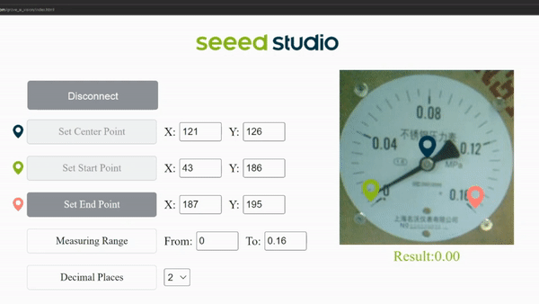

# EdgeLab Deployment on Grove Vision AI

<div align="center">
  
  <h3> <a href="https://edgelab.readthedocs.io/en/latest/"> Documentation </a> | <a href="https://edgelab.readthedocs.io/zh_CN/latest/"> 中文文档 </a>  </h3>
</div>

English | [简体中文](README_zh-CN.md)

- [How to build the firmware](#how-to-build-the-firmware)
- [How to flash the firmware](#how-to-flash-the-firmware)
- [How to preview](#how-to-preview)
- [Performance](#performance)

## How to build the firmware?

This explains how you can build the firmware for Grove - Vision AI Module.

```note
The following has been tested to work on Ubuntu 20.04 PC
```

- **Step 1:** Install the following prerequisites

```sh
sudo apt install make
sudo apt install python3-numpy
```

- **Step 2:** Download GNU Development Toolkit

```sh
cd ~
wget https://github.com/foss-for-synopsys-dwc-arc-processors/toolchain/releases/download/arc-2020.09-release/arc_gnu_2020.09_prebuilt_elf32_le_linux_install.tar.gz
```

- **Step 3:** Extract the file

```sh
tar -xvf arc_gnu_2020.09_prebuilt_elf32_le_linux_install.tar.gz
```

- **Step 4:** Add **arc_gnu_2020.09_prebuilt_elf32_le_linux_install/bin** to **PATH**

```sh
export PATH="$HOME/arc_gnu_2020.09_prebuilt_elf32_le_linux_install/bin:$PATH"
```

- **Step 5:** Clone the following repository and go into the directory

```sh
git clone https://github.com/Seeed-Studio/edgelab-example-vision-ai
cd edgelab-example-vision-ai
```

- **Step 6:** Download related third party, tflite model and library data (only need to download once)

```sh
make download
```

- **Step 7:** Compile the firmware

```sh
make HW=grove_vision_ai APP=meter # APP argument is the directory name under examples/
make flash
```

This will generate **output.img** inside **tools/image_gen_cstm/output/** directory


- **Step 8:** Generate firmware image **firmware.uf2** file

```sh
python3 tools/ufconv/uf2conv.py -t 0 -c tools/image_gen_cstm/output/output.img -o firmware.uf2
```

- **Step 9:** Convert pre-trained model meter.tflite to **model.uf2** file

```sh
python3 tools/ufconv/uf2conv.py -t 1 -c ../model_zone/pfld_meter_int8.tflite -o model.uf2
```
## How to flash the firmware?

This explains how you can flash the firmware to Grove - Vision AI Module.

- **Step 1:** Connect Grove - Vision AI Module to the host PC via USB Type-C cable 

<div align=center></div>

- **Step 2:** Double-click the boot button on Grove - Vision AI Module to DFU mode

<div align=center></div>

- **Step 3:** After this you will see a new storage drive shown on your file explorer as **GROVEAI**

<div align=center></div>

- **Step 4:** Drag and drop the prevous **firmware.uf2** and **model.uf2** file to GROVEAI drive in sequence.

```note
You need to enter DFU mode twice separately, once to flash the firmware and once to flash the model.Once the copying is finished **GROVEAI** drive will disapper. This is how we can check whether the copying is successful or not.
```

## How to view the camera stream? (Grove AI Family firmware)

- **Step 1:** After loading the firmware and connecting to PC, visit [this URL](https://files.seeedstudio.com/grove_ai_vision/index.html)

- **Step 2:** Click **Connect** button. Then you will see a pop up on the browser. Select **Grove AI - Paired** and click **Connect**
  
<div align=center></div>

- **Step 2:** Setup **config** 

After that, you can see the real-time video stream on the Web Page.

<div align=center></div>

### Performance 

The performance of the EdgeLab-related models, measured on different chipsets, is summarized in the following table.

| Target | Model | Dataset | Input Resolution | Peak RAM |Inferencing  Time | F1 Score|Link|
| ---- | -----| ---| ---| -----------| --------| --------| --------|
| Grove Vision AI |          Meter         | [custom](https://files.seeedstudio.com/wiki/Edgelab/meter.zip)|112x112 (RGB)| 320KB |     500ms    |  97% |[pfld_meter_int8.tflite](./model_zone/pfld_meter_int8.tflite)|
| Grove Vision AI  |          Fomo          | [custom]()|96x96 (GRAY)| 244KB |    150ms    |  99.5%|[fomo_int8.tflite](./model_zone/fomo_mask_int8.tflite)|

## Contributing
- If you find an issue in these examples, or wish to submit an enhancement request, please use the Issues section on Github.


## License

These examples are covered under MIT License.