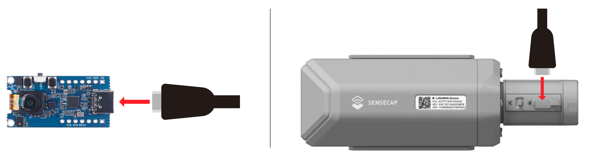
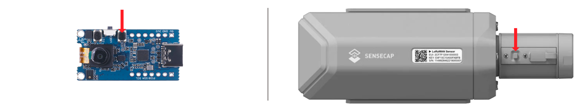
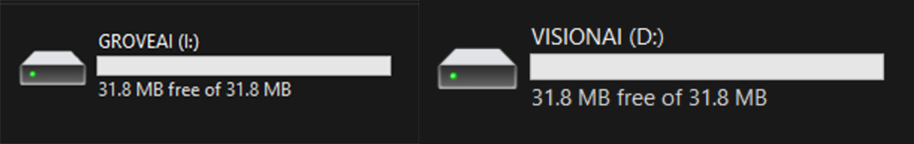
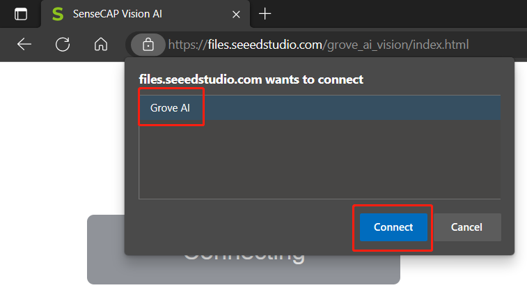

# Train and deploy a fomo model on Grove - Vision AI

## Introduction

This tutorial shows how to train and deploy a fomo reading detection model on Grove - Vision AI

## Prerequisites

### Hardware
- PC with Linux, WSL2 is also supported.
- Grove - Vision AI
- USB cable

### Software
- [EdgeLab](https://edgelab.readthedocs.io/zh_CN/latest/)
- [edgelab-example-vision-ai](https://github.com/Seeed-Studio/edgelab-example-vision-ai)

```{note}
Plesae make sure that you have installed the latest version of EdgeLab
```

## Train the model

### Prepare the dataset

Use the provided dataset to train the model.

```bash
cd EdgeLab
mkdir -p datasets
cd datasets
wget https://files.seeedstudio.com/wiki/Edgelab/coco_mask.zip
unzip coco_mask.zip
```

### Prepare the configuration file


### Train the model


## Convert the model

**Step 1:** Convert models to TensorFlow Lite.


Now we will convert the generated TFLite file to a UF2 file so that we can directly flash the UF2 file into Grove - Vision AI Module and SenseCAP A1101

**Step 2:** Execute the following

```bash
cd edgelab-example-vision-ai
python tools/uf2conv/ -f GROVEAI -t 1 -c <path to model.tflite> -o model.uf2
```

### Flash the model and model

This explains how you can flash the previously generated firmware (firmware.uf2) and the model file (model.uf2) to Grove - Vision AI Module and SenseCAP A1101.

**Step 1.** Connect Grove - Vision AI Module/ SenseCAP A1101 to PC by using USB Type-C cable 

<div align=center></div>

**Step 2.** Double click the boot button to enter **boot mode**

<div align=center></div>

**Step 3:** After this you will see a new storage drive shown on your file explorer as **GROVEAI** for **Grove - Vision AI Module** and as **VISIONAI** for **SenseCAP A1101**

<div align=center></div>

**Step 4:** Drag and drop the previous **firmware.uf2** at first, and then the **model.uf2** file to **GROVEAI** or **VISIONAI** 

```note
You need to enter DFU mode twice separately, once to flash the firmware and once to flash the model.Once the copying is finished **GROVEAI** drive will disapper. This is how we can check whether the copying is successful or not.
```

## Run the model 

**Step 1:** After loading the firmware and connecting to PC, visit [this URL](https://files.seeedstudio.com/grove_ai_vision/index.html)
        
**Step 2:** Click **Connect** button. Then you will see a pop up on the browser. Select **Grove AI - Paired** and click **Connect**
<div align=center></div>
        
<div align=center></div>
        


