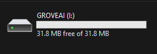

# EdgeLab 在 Grove Vision AI 上的部署
<div align="center">
  
  <h3> <a href="https://edgelab.readthedocs.io/en/latest/"> Documentation </a> | <a href="https://edgelab.readthedocs.io/zh_CN/latest/"> 中文文档 </a> </h3>
</div>

English | [简体中文](README_zh-CN.md)

- [如何构建固件](#如何构建固件)
- [如何烧录固件与模型](#如何烧录固件与模型)
- [如何预览](#如何预览)
- [性能](#性能)

## 如何构建固件？

```note
Note: 以下已经在Ubuntu 20.04 PC上测试过。
```

- **Step 1:** 安装以下依赖项

```sh
sudo apt install make
sudo apt install python3-numpy
```

- **Step 2:** 下载GNU开发工具包

```sh
cd ~
wget https://github.com/foss-for-synopsys-dwc-arc-processors/toolchain/releases/download/arc-2020.09-release/arc_gnu_2020.09_prebuilt_elf32_le_linux_install.tar.gz
```

- **Step 3:** 解压文件

```sh
tar -xvf arc_gnu_2020.09_prebuilt_elf32_le_linux_install.tar.gz
```

- **第四步：**将**arc_gnu_2020.09_prebuilt_elf32_le_linux_install/bin**添加到**PATH**。

``sh
export PATH="$HOME/arc_gnu_2020.09_prebuilt_elf32_le_linux_install/bin:$PATH"
```

- **第5步：**克隆以下版本库并进入该目录

```sh
git clone https://github.com/Seeed-Studio/edgelab-example-vision-ai
cd edgelab-example-vision-ai
```

- **第6步：**下载相关的第三方，tflite模型和库数据（只需要下载一次）。

```sh
make download
```

- **第7步：**编译固件

``sh
make HW=grove_vision_ai APP=meter # APP参数是examples/下的目录名称。
制作flash
```

这将在**tools/image_gen_cstm/output/**目录下产生**output.img**。


- **第8步：**生成固件镜像**firmware.uf2**文件

```sh
python3 tools/ufconv/uf2conv.py -t 0 -c tools/image_gen_cstm/output/output.img -o firmware.uf2
```

- **Step 9:** 将 meter.tflite 转换为 **model.uf2** 格式

```sh
python3 tools/ufconv/uf2conv.py -t 1 -c ./model_zoo/ pfld_meter_int8.tflite -o model.uf2
```
## 如何烧录固件与模型？

- **Step 1:** 通过 USB Type-C 将 Grove - Vision AI 连接到 PC


- **Step 2:** 双击BOOT键，使得 Grove - Vision AI 进入 DFU 模式


- **Step 3:** 看到一个 **GROVEAI** 的新的存储设备，



- **Step 4:** 将 **firmware.uf2** 还有 **model.uf2** 依次复制到 **GROVEAI** 设备中

```note
Note: 你需要分开两次进入 DFU 模式，一次烧录固件，一次烧录模型。
当**GROVEAI**设备消失时，表面固件或模型已经烧录完成。
```

## 如何预览固件？

- **Step 1:** 完成上述的操作后, 打开[链接](https://files.seeedstudio.com/grove_ai_vision/index.html)

- **Step 2:** 点击 **Connect** 按钮. 你可以看到一个弹出窗口. 选择 **Grove AI - Paired** 然后点击 **Connect** 进行连接
  


接着你就可以看到一个预览界面了.


### 性能 


| Target | Model | Dataset | Input Resolution | Peak RAM |Inferencing Time | F1 Score|Link|
| ---- | -----| ---| ---| -----------| --------| --------| --------|
| Grove Vision AI | 仪表 | [自定义](https://files.seeedstudio.com/wiki/Edgelab/meter.zip)|112x112 (RGB)| 320KB | 500ms | 97%|[pfld_meter_int8.tflite](./model_zoo/pfld_meter_int8.tflite)|
| Grove Vision AI | Fomo | [custom]()|96x96 (GRAY)| 244KB | 150ms | 99.5%|[fomo_mask_int8.tflite](./model_zoo/fomo_mask_int8.tflite)|

## 贡献

- 如果你在这些例子中发现问题，或希望提交一个请求，请使用Github上的issues


## 许可证

这些例子是在MIT许可下进行的。
