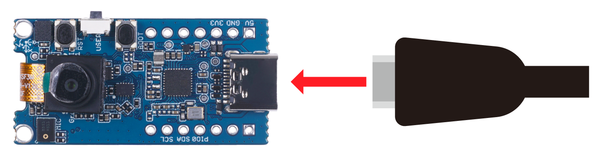
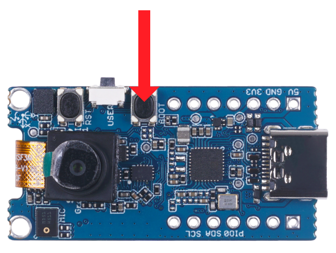
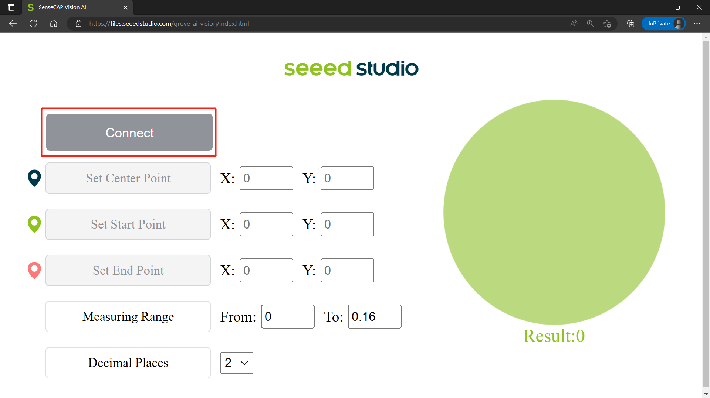
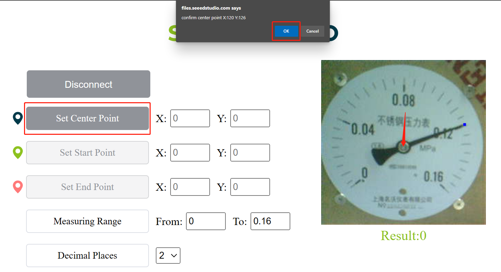
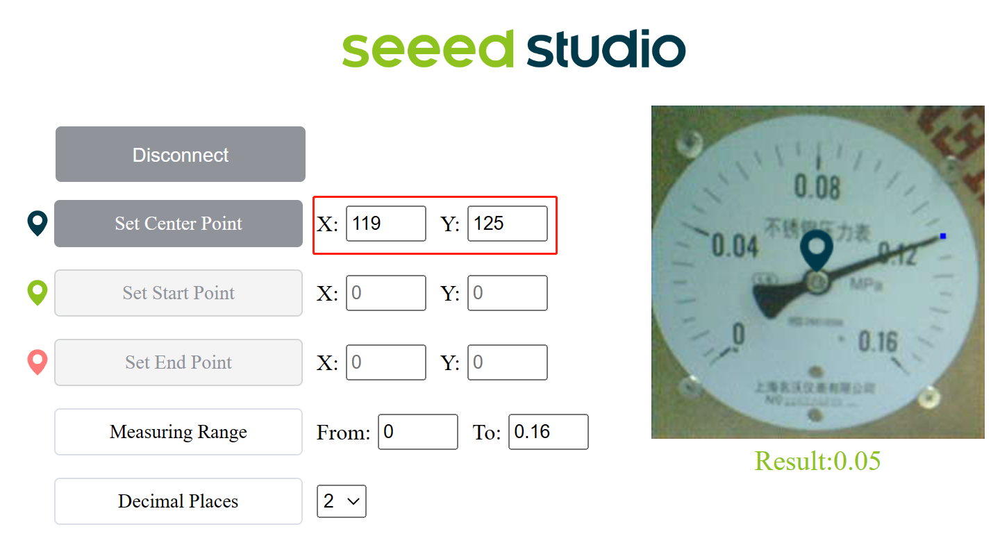
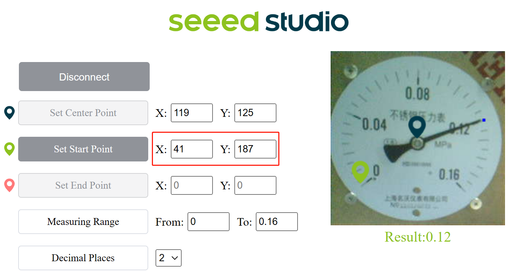
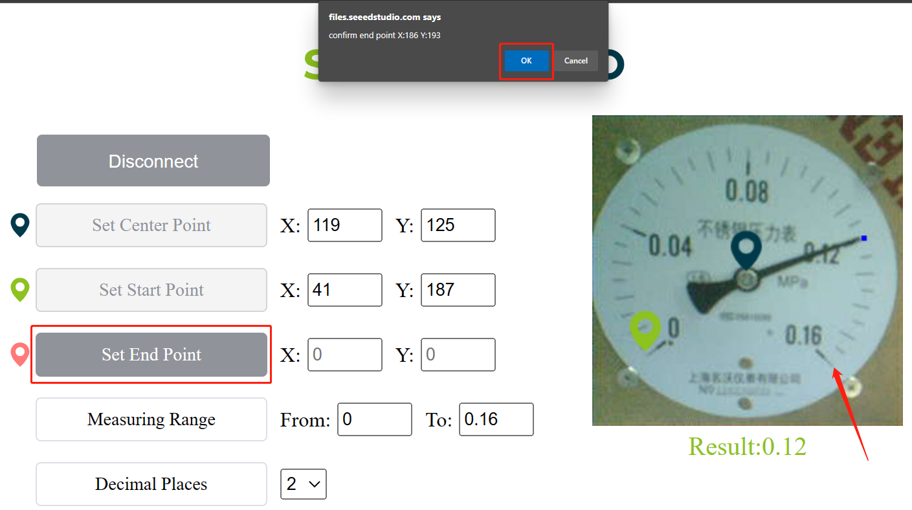
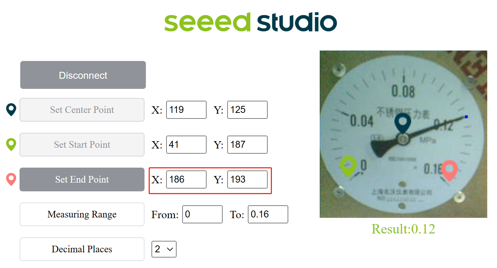

# 在Grove上训练和部署一个fomo模型 - Vision AI

## 简介

本教程展示了如何在Grove - Vision AI上训练和部署一个读表检测模型。

## 前提条件

### 硬件
- 使用Linux的PC，也支持WSL2。
- Grove - Vision AI
- USB电缆

### 软件
- [EdgeLab](https://edgelab.readthedocs.io/zh_CN/latest/)
- [Edgelab-example-vision-ai](https://github.com/Seeed-Studio/edgelab-example-vision-ai)

```{注意}
请确保你已经安装了EdgeLab的最新版本
```

## 训练模型
### 准备数据集
使用我们提供的数据集来训练模型。

```bash
cd EdgeLab
mkdir -p datasets
cd datasets
wget https://files.seeedstudio.com/wiki/Edgelab/meter.zip
unzip meter.zip
```

### 准备配置文件
```python
_base_ = '../_base_/default_runtime.py'

num_classes=1
model = dict(type='PFLD',
             backbone=dict(type='PfldMobileNetV2',
                           inchannel=3,
                           layer1=[16, 16, 16, 16, 16],
                           layer2=[32, 32, 32, 32, 32, 32],
                           out_channel=16),
             head=dict(
                 type='PFLDhead',
                 num_point=num_classes,
                 input_channel=16,
             ),
             loss_cfg=dict(type='PFLDLoss'))


# dataset settings
dataset_type = 'MeterData'

data_root = '../work_dirs/datasets/meter'
height=112
width=112
batch_size=32
workers=4

train_pipeline = [
    dict(type="Resize", height=height, width=width, interpolation=0),
    dict(type='ColorJitter', brightness=0.3, p=0.5),
    # dict(type='GaussNoise'),
    dict(type='MedianBlur', blur_limit=3, p=0.3),
    dict(type='HorizontalFlip'),
    dict(type='VerticalFlip'),
    dict(type='Rotate'),
    dict(type='Affine', translate_percent=[0.05, 0.1], p=0.6)
]

val_pipeline = [dict(type="Resize", height=height, width=width)]


data = dict(
    samples_per_gpu=batch_size,
    workers_per_gpu=workers,
    train=dict(type=dataset_type,
               data_root=data_root,
               index_file=r'train/annotations.txt',
               pipeline=train_pipeline,
               test_mode=False),
    val=dict(type=dataset_type,
             data_root=data_root,
             index_file=r'val/annotations.txt',
             pipeline=val_pipeline,
             test_mode=True),
    test=dict(type=dataset_type,
              data_root=data_root,
              index_file=r'val/annotations.txt',
              pipeline=val_pipeline,
              test_mode=True
              # dataset_info={{_base_.dataset_info}}
              ))


lr=0.0001
epochs=300
evaluation = dict(save_best='loss')
optimizer = dict(type='Adam', lr=lr, betas=(0.9, 0.99), weight_decay=1e-6)
optimizer_config = dict(grad_clip=dict(max_norm=35, norm_type=2))
# learning policy
lr_config = dict(policy='step',
                 warmup='linear',
                 warmup_iters=400,
                 warmup_ratio=0.0001,
                 step=[400, 440, 490])
total_epochs = epochs
find_unused_parameters = True
```
保存为EdgeLab/configs/pfld/pfld_mv2n_112_custom.py

### 训练模型

#### 获取预训练模型
```bash
cd EdgeLab
mkdir -p work_dirs/pretrain/ && cd work_dirs/pretrain
wget  https://github.com/Seeed-Studio/EdgeLab/releases/download/model_zoo/pfld_mv2n_112.pth 
```

##### 训练表记模型模型

```bash
cd EdgeLab
conda activate edgelab
python tools/train.py mmpose configs/pfld/pfld_mv2n_112_custom.py --gpus=1 --cfg-options total_epochs=50 load_from=./work_dirs/pretrain/pfld_mv2n_112.pth 
```
训练完成的模型会存储到 **exp**`<x>`目录下，x是训练的工作目录

## 模型转换

**Step 1:** 将模型转换为TensorFlow Lite。

```bash
cd EdgeLab
conda activate edgelab
python tools/torch2tflite.py mmpose  configs/pfld/pfld_mv2n_112_custom.py --weights work_dirs/pfld_mv2n_112_custom/exp1/latest.pth --tflite_type int8 
```

```{note}
注意：路径中的exp1是第一次训练是生成的，如果您多次训练expx会依次累加。
```

现在我们将把生成的TFLite文件转换为UF2文件，这样我们就可以直接把UF2文件闪存到Grove - Vision AI Module和SenseCAP A1101中。

**第2步:** 将TFLite文件转换为UF2文件。

```bash
cd edgelab-example-vision-ai
python tools/uf2conv/ -f GROVEAI -t 1 -c <path to model.tflite> -o model.uf2

```


## 将模型和固件烧录到Grove - Vision AI Module和SenseCAP A1101

以下是如何将先前生成的固件（firmware.uf2）和模型文件（model.uf2）闪存到Grove - Vision AI Module和SenseCAP A1101的说明。


**Step 1.** 通过USB Type-C 将Grove - Vision AI Module/ SenseCAP A1101连接到PC


**Step 2.** 双击 `boot` 按键进入 **DFU** 模式



**Step 3:** 你会看到一个新的存储设备 **GROVEAI** 是 **Grove - Vision AI Module** **VISIONAI** 是 **SenseCAP A1101**



**Step 4:** 将生成 **firmware.uf2** 复制到对应的存储设备中, 重复进入DFU模式后将 **model.uf2**复制到对应的存储设备中

```note
注意: 你需要分开两次进入 DFU 模式，一次烧录固件，一次烧录模型。
当GROVEAI设备消失时，表面固件或模型已经烧录完成。
```


## 运行模型
**Step 1:** 完成上述的模型还有固件烧录工作后, 打开 [链接](https://files.seeedstudio.com/grove_ai_vision/index.html)
        
**Step 2:** 点击 **Connect** 按钮. 你会看到一个弹出窗口. 选择 **Grove AI - （配对）** 然后点击**Connect**

        

        
如果连接成功，你会看到以下界面
        

        
现在我们需要设置3个点，分别是中心点，起始点和结束点。

**Step 3:** 点击 **Set Center Point** 然后选择预览界面中指针中心点位置. 你会看到一个弹出窗口，确认位置后点击 **OK**
        

        
你会看到中心点已经被记录
        

        
**Step 4:** 点击 **Set Start Point**  然后选择预览界面中指针起始位置.你会看到一个弹出窗口，确认位置后点击 **OK**
        

        
你会看到起始点已经被记录
        

        
**Step 5:** Click on **Set End Point** 然后选择预览界面中指针结束位置.你会看到一个弹出窗口，确认位置后点击 **OK**


        
你会看到结束点已经被记录
        

        
**Step 6:** 根据表盘的第一位和最后一位数字设置测量范围。例如，我们设置为 **From:0 To 0.16**


        

**Step 7:** 配置小数点位数. 这里我们设置为2
        

        
最后，你可以看到实时表盘读数结果，如下所示
        


